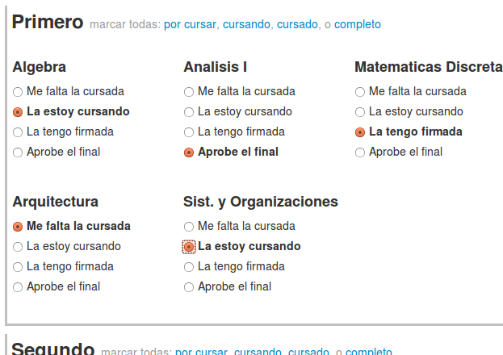
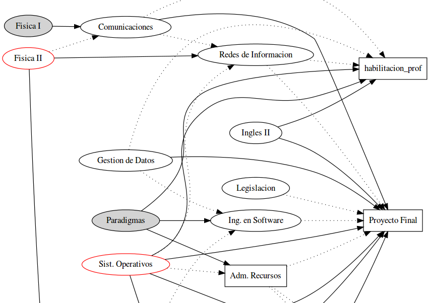

Arma el grafo de tu Carrera
===========================

Herramienta para estudiantes de _Sistemas de Informacion_ de la **UTN FRBA, plan 08**.

Demo: [http://martinscotta.com/utn-dot/](http://martinscotta.com/utn-dot/)

--------------------------------------------------------

Herramienta para la visualizacion del _estado actual_ de tu carrera; se muestran las materias y sus correlatividades en un grafo dirigido.

# ¿Como generar el grafico?

Primero completa las materias segun las tengas cursadas, o aprobadas..

..luego haz click en **Generar Grafico**, y aparecera el link para ver el mismo.

# ¿Como son los graficos?

Referencias:
- Nodos Circulares: Cuatrimestrales
- Nodos Rectangulares: Anuales
- Nodos fondo Gris: Materia firmada; cursada pero sin dar el final.
- Nodos borde Rojo: Actualmente cursando esa materia
- Arista Solida: Correlatividad de Final para Cursar
- Arista Punteada: Correlatividad de Cursada para Cursar

